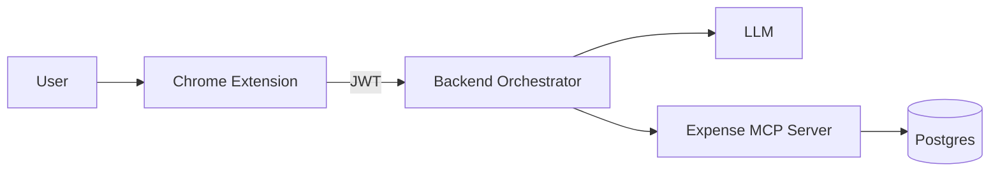
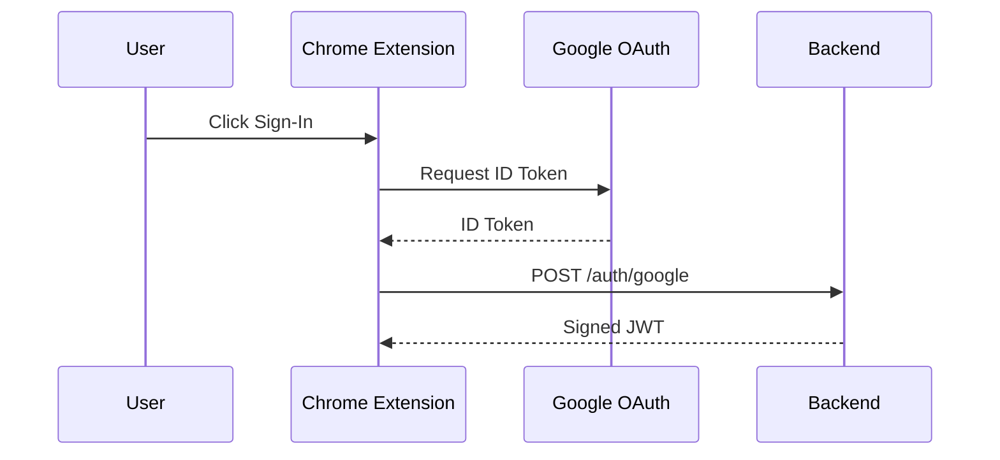
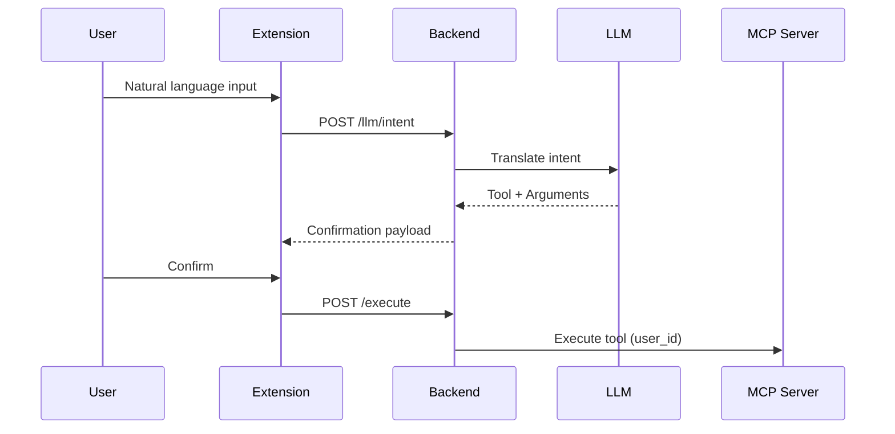

# 💰 Floating AI Expense Assistant

**A human-in-the-loop, AI-powered expense management system using a Chrome Extension + MCP-based Backend Orchestrator**

> Resume-grade, production-inspired architecture demonstrating modern frontend, backend, AI orchestration, and security best practices.

---

## 📌 High-Level Overview

This project consists of **two major components**:

1. **Floating Chrome Extension (Thin Client)**
2. **AI Backend Orchestrator (JWT-based, MCP-aware)**

The system allows users to manage expenses using **natural language**, while ensuring:

* Explicit user confirmation before execution
* Strong security boundaries
* Clean separation of concerns
* MCP philosophy compliance

---

## 🧭 System Architecture (Bird’s Eye View)

```
┌────────────────────────────┐
│  Chrome Extension (UI)     │
│────────────────────────────│
│ • Floating Widget          │
│ • Google Sign-In           │
│ • Confirmation UI          │
│ • BYOK Settings            │
│ • NO LLM LOGIC             │
└──────────────┬─────────────┘
               │ JWT
               ▼
┌──────────────────────────────────────────────┐
│        AI Backend Orchestrator (Node.js)     │
│──────────────────────────────────────────────│
│ • Google OAuth Verification                  │
│ • JWT Authentication                         │
│ • Intent → Tool Translation (LLM)            │
│ • Tool Validation & Safety Checks            │
│ • Encrypted BYOK Storage (Supabase)          │
│ • MCP Client                                 │
└──────────────┬───────────────────────────────┘
               │ MCP Tool Call + user_id
               ▼
┌──────────────────────────────────────────────┐
│          Expense MCP Server (FastMCP)        │
│──────────────────────────────────────────────│
│ • add_expense                                │
│ • get_expenses                               │
│ • update_expense                             │
│ • delete_expense                             │
│ • stats & search                             │
│ • PostgreSQL                                 │
│ • NO AUTH / NO LLM                           │
└──────────────────────────────────────────────┘
```

---

## 🎯 Design Philosophy

### Human-in-the-Loop AI

1. User writes natural language command
2. Backend LLM **only translates** intent
3. User explicitly confirms action
4. Backend executes via MCP

> ❗ The AI never auto-executes actions

---

## 🧩 Component Breakdown

## 1️⃣ Chrome Extension — Thin Client

### Responsibilities

✅ UI rendering (floating widget)
✅ Google Sign-In (Chrome Identity API)
✅ JWT storage (chrome.storage)
✅ Confirmation before execution
✅ BYOK management UI

### Explicitly NOT Responsible For

❌ Calling LLM APIs
❌ Parsing intent
❌ Choosing tools
❌ Storing API keys
❌ Executing actions

---

### 📁 Extension Project Structure

```
floating-ai-expense-extension/
│
├── manifest.json              # MV3 configuration
├── package.json               # Dependencies
├── webpack.config.js          # Build config
│
├── public/
│   └── styles.css             # Global styles
│
├── src/
│   ├── contentScript.jsx      # Entry point
│   ├── FloatingWidget.jsx     # Main UI shell
│   ├── Auth.jsx               # Google Sign-In
│   ├── Settings.jsx           # BYOK & profile
│   ├── ConfirmAction.jsx      # Confirmation UI
│   └── api.js                 # Backend client
│
└── dist/
    └── contentScript.js       # Compiled bundle
```

---

### 🔐 Authentication Flow (Chrome Extension)

```
User clicks “Sign in with Google”
        ↓
Chrome Identity API returns ID Token
        ↓
POST /auth/google
        ↓
Backend verifies with Google
        ↓
Backend issues JWT
        ↓
JWT stored in chrome.storage.local
```

---

## 2️⃣ Backend Orchestrator — AI Decision Layer

### What This Backend Is

✔ AI-powered orchestration layer
✔ Security boundary
✔ Tool execution gate
✔ Multi-user isolation enforcer

### What This Backend Is NOT

❌ Traditional CRUD API
❌ Chatbot
❌ Expense database
❌ MCP server

---

## 🔑 Authentication Model (UPDATED)

### ✅ JWT-Based Authentication (No Sessions)

This system **uses stateless JWT authentication**, not server-side sessions.

### Flow

```
1. Client sends Google ID Token
2. Backend verifies token with Google
3. Backend creates / fetches user
4. Backend signs JWT (user_id, email)
5. Client stores JWT
6. JWT sent on every request
```

### JWT Payload Example

```json
{
  "user_id": "google-sub-123",
  "email": "user@example.com",
  "iat": 1700000000,
  "exp": 1700003600
}
```

---

## 🧠 Why LLM Lives in Backend (NOT MCP)

### ✅ Correct Architecture

```
User → Backend (LLM) → Structured JSON → MCP Tool
```

### ❌ Wrong Architecture

```
User → MCP Server with LLM + Logic
```

### Why This Matters

* MCP servers remain reusable
* Backend controls security
* LLM is sandboxed
* Tool execution is deterministic

---

## 🔐 Security Model

### 🔒 Layers of Security

1. **Google OAuth** — Identity
2. **JWT** — Stateless auth
3. **AES-256-GCM Encryption** — BYOK
4. **Tool Allow-List** — Execution safety
5. **user_id Injection** — Data isolation

---

## 🔑 BYOK (Bring Your Own Key)

Users may optionally provide their own LLM API keys.

### Key Properties

✅ Encrypted before storage
✅ Stored in Supabase only
✅ Decrypted in memory
✅ Never logged

---

## 🗄️ Supabase Usage

### What Supabase Stores

```sql
users
user_llm_keys
```

### What It NEVER Stores

❌ Expenses
❌ Tool results
❌ Plaintext secrets

---

## 📡 API Surface

### Auth

```
POST /auth/google
POST /auth/logout
GET  /auth/me
```

### LLM

```
POST /llm/intent
POST /llm/keys
GET  /llm/keys
DELETE /llm/keys
```

### Execution

```
POST /execute
POST /execute/combined
GET  /execute/tools
GET  /execute/health
```

---

## 🧪 Local Development Flow

### Extension

```bash
npm install
npm run dev
```

Load unpacked extension → `chrome://extensions`

### Backend

```bash
npm install
npm run dev
```

---

## 🧠 Tool Execution Flow

```
User Input
   ↓
LLM → { tool, arguments }
   ↓
Validation Layer
   ↓
User Confirmation
   ↓
MCP Execution
```

---

## 📊 Why This Is Resume-Grade

* Demonstrates MCP architecture
* Clean AI separation
* Secure BYOK handling
* JWT-based auth
* Chrome Extension MV3
* Supabase + PostgreSQL
* Real-world security mindset

---

## 🎓 Interview Explanation (Short)

> “This is a human-in-the-loop AI system where the frontend is intentionally dumb, the backend acts as an AI decision layer, and MCP servers remain pure executors. Authentication is JWT-based with Google OAuth, and all user secrets are encrypted. The architecture mirrors how AI tooling should be built in production.”

---

## 🚀 Future Improvements

* Redis-based rate limiting
* Audit logs per tool call
* Webhook-based async execution
* OpenAPI spec generation
* CI/CD pipeline

---

## 📜 License

MIT

---

**Built with ❤️ as a serious architecture demonstration, not a toy project.**

---

# 📊 Visual Diagrams (Mermaid)

## System Architecture



## Authentication Flow (JWT)



## Intent → Execution Flow



---

# 📄 Short README (Recruiter-Friendly)

## Floating AI Expense Assistant

A Chrome Extension + AI backend that allows users to manage expenses using natural language — safely, transparently, and with full user control.

### Highlights

* Human-in-the-loop AI (no auto-execution)
* JWT-based Google authentication
* MCP-compliant backend orchestration
* Encrypted BYOK support
* Chrome Extension (MV3)

### Tech Stack

* Frontend: React, Chrome Extensions MV3
* Backend: Node.js, JWT, Supabase
* AI: Gemini / OpenAI (BYOK)
* Protocol: MCP (Model Context Protocol)

---


