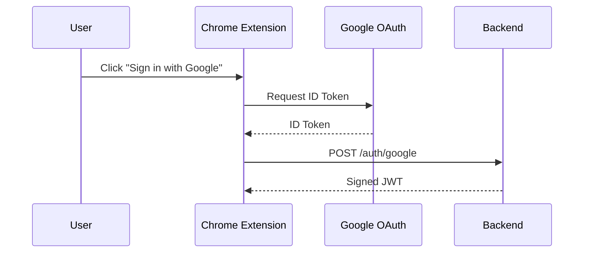
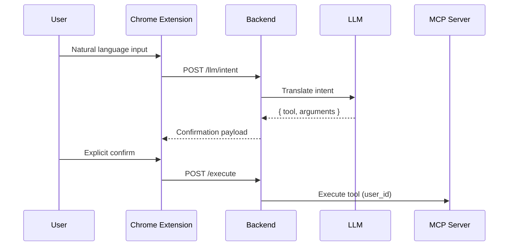

# 💰 Floating AI Expense Assistant

**A human-in-the-loop, AI-powered expense management system built using a Chrome Extension + MCP-based Backend Orchestrator**

> A production-inspired system demonstrating **correct AI boundaries**, **MCP compliance**, and **security-first orchestration** — not a toy chatbot.

---

## 📌 High-Level Overview

This project is composed of **three explicitly separated layers**, each with a single responsibility:

1. **Chrome Extension (Thin Client UI)**
2. **AI Backend Orchestrator (Decision & Security Layer)**
3. **Expense MCP Server (Pure Tool Executor)**

The system enables users to manage expenses via **natural language**, while guaranteeing:

- Explicit user confirmation before execution
- Deterministic tool behavior
- Strict security boundaries
- Correct MCP philosophy adherence

---

## 🧭 System Architecture (Bird’s-Eye View)

```mermaid
flowchart TB
    U[User]
    CE[Chrome Extension<br/>Thin Client UI]
    BO[Backend Orchestrator<br/>AI Decision Layer]
    LLM[LLM<br/>Intent Translation Only]
    MCP[Expense MCP Server<br/>Pure Tools]
    DB[(PostgreSQL)]

    U --> CE
    CE -->|JWT| BO
    BO --> LLM
    BO --> MCP
    MCP --> DB
````

---

## 🎯 Design Philosophy

### Human-in-the-Loop AI (Non-Autonomous)

1. User enters a natural-language command
2. Backend LLM **only translates intent**
3. User explicitly confirms the action
4. Backend executes **exactly one MCP tool**

> ❗ The AI never auto-executes
> ❗ MCP servers never contain intelligence

---

## 🧩 Component Breakdown

---

## 1️⃣ Chrome Extension — Thin Client

### Responsibilities

* Floating UI rendering
* Google Sign-In (Chrome Identity API)
* JWT storage (`chrome.storage.local`)
* Confirmation UI
* BYOK management interface

### Explicitly NOT Responsible For

* Calling LLM APIs
* Parsing intent
* Selecting tools
* Executing actions
* Storing expenses or secrets

---

### 📁 Extension Structure

```
floating-ai-expense-extension/
│
├── manifest.json          # MV3 configuration
├── webpack.config.js
├── public/
│   └── styles.css
│
├── src/
│   ├── contentScript.jsx
│   ├── FloatingWidget.jsx
│   ├── Auth.jsx
│   ├── Settings.jsx
│   ├── ConfirmAction.jsx
│   └── api.js
│
└── dist/
    └── contentScript.js
```

---

### 🔐 Authentication Flow (Chrome Extension)



---

## 2️⃣ Backend Orchestrator — AI Decision Layer

### What This Backend IS

* AI intent translation layer
* Security boundary
* Tool execution gatekeeper
* Multi-tenant isolation enforcer

### What This Backend IS NOT

* Expense database
* MCP server
* Autonomous agent
* Chatbot with side effects

---

### 🔑 Authentication Model (JWT-Based)

```
1. Extension sends Google ID Token
2. Backend verifies token with Google
3. Backend creates / fetches user
4. Backend issues signed JWT
5. JWT attached to every request
```

#### JWT Payload Example

```json
{
  "user_id": "google-sub-123",
  "email": "user@example.com",
  "iat": 1700000000,
  "exp": 1700003600
}
```

---

## 🧠 Why the LLM Lives in the Backend (NOT MCP)

### ✅ Correct Architecture

```
User → Backend (LLM) → Structured JSON → MCP Tool
```

### ❌ Incorrect Architecture

```
User → MCP Server with LLM + Logic
```

### Why This Separation Matters

* MCP servers stay reusable
* Tool execution is deterministic
* LLM output is sandboxed & validated
* Security remains centralized

---

## 🔐 Security Model (Defense-in-Depth)

1. Google OAuth — identity verification
2. JWT — stateless authentication
3. AES-256-GCM — BYOK encryption
4. Tool allow-list — execution safety
5. `user_id` injection — data isolation

---

## 🔑 BYOK (Bring Your Own Key)

Users may optionally provide their own LLM API key.

**Guarantees**

* Encrypted before storage
* Stored only in Supabase
* Decrypted in memory only
* Never logged or exposed

---

## 🧩 Expense MCP Server

### Purpose

A **pure MCP tool server** responsible only for **expense operations**.

### Hard Rules

* No authentication
* No LLM
* No business decisions
* Deterministic execution
* Backend-injected `user_id`

---

## 🛠️ MCP Tool Definitions

### 1️⃣ add_expense

Adds a new expense record.

**Arguments**

* user_id (string, required)
* date (YYYY-MM-DD)
* amount (positive number)
* category (string)
* merchant (optional)
* note (optional)

---

### 2️⃣ list_expenses

Lists expenses within a date range.

**Arguments**

* user_id
* start_date (YYYY-MM-DD)
* end_date (YYYY-MM-DD)

---

### 3️⃣ summarize_expenses

Aggregates expenses by category.

**Arguments**

* user_id
* start_date
* end_date

**Returns**

* Array of `{ category, total }` ordered by total DESC

---

### 4️⃣ monthly_report

Generates a monthly summary.

**Arguments**

* user_id
* month (YYYY-MM)

**Returns**

* total_spending
* expense_count
* category_breakdown
* natural-language summary

---

## 🧠 Intent → Execution Flow



---

## 📊 Why This Is Resume-Grade

* Correct MCP architecture
* Human-in-the-loop AI
* Deterministic tool execution
* JWT-based Google authentication
* Secure BYOK handling
* Chrome Extension (MV3)

---

## 🎓 Interview One-Liner

> “This is a human-in-the-loop AI system where the frontend is intentionally dumb, the backend acts as an AI decision layer, and MCP servers remain pure executors with deterministic behavior.”

---

## 🚀 Future Improvements

* Redis-based rate limiting
* Per-tool audit logs
* Async execution via queues
* OpenAPI generation
* CI/CD pipeline

```